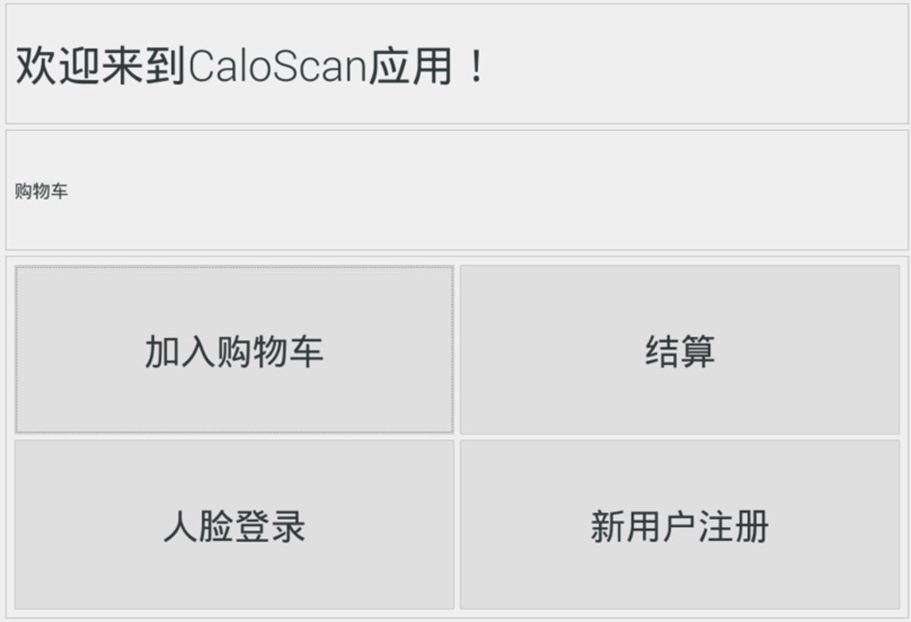
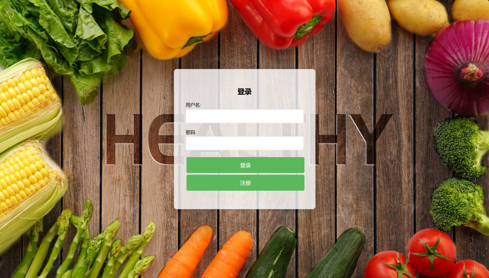

# CaloScan

**CaloScan: All-in-One Nutrition & POS System**  
智能饮食分析 + 收银一体化系统

--- 

## Table of Contents
1. [Project Overview](#project-overview)
2. [Features](#features)
3. [Demo](#demo)
4. [Installation](#installation)
5. [Usage](#usage)
6. [Architecture](#architecture)
7. [Technologies](#technologies)
8. [Contributing](#contributing)
9. [License](#license)

---

## Project Overview
CaloScan addresses the growing demand for efficient and healthy dining in community canteens across the country. With the rise of various community dining facilities and the increasing attention of modern people to dietary health, traditional canteen operations face several challenges:

- **Low Efficiency During Peak Hours**: Manual checkout is slow and inefficient, especially during mealtimes.

- **High Management Pressure**: Backend management of multiple canteens is labor-intensive, with significant differences in performance between locations.

- **Difficult Record Keeping**: Manual dietary records are cumbersome and hard to maintain, particularly for elderly users who are more concerned about their health.

- **Challenging Analysis**: Most users lack the knowledge to interpret nutritional information.

- **Limited Personalized Guidance**: There is a shortage of individualized dietary recommendations.

CaloScan aims to overcome these issues by integrating automatic dish recognition and weighing, synchronized dietary records, personalized analysis, and intelligent recommendations, while providing an admin backend for canteen managers to efficiently manage dish information.

---

## Features
- **Automatic Dish Recognition + Weighing**: Fully automated checkout system.  
- **Synchronized Dietary Records**: Dish information is uploaded automatically during payment.  
- **Personalized Analysis & Recommendations**: Intelligent dietary suggestions via WeChat Mini Program.  
- **Admin Backend**: Canteen managers can manage dish information efficiently.  

---

## Demo
<div align="center">

| Wechat Mini Program Demo 1 | Wechat Mini Program Demo 2 | Wechat Mini Program Demo 3 |
|--------|--------|--------|
|  |  |  |

| Wechat Mini Program Demo 4 | Wechat Mini Program Demo 5 | Wechat Mini Program Demo 6 |
|--------|--------|--------|
|  |  |  |

</div>

<div align="center">

| Qt Demo 1 | Qt Demo 2 |
|--------|--------|
|  |  |

</div>

<div align="center">

| Web Demo 1 | Web Demo 2 |
|--------|--------|
|  |  |

<div>


---

## Installation
```bash
# 克隆仓库
git clone https://github.com/yourusername/CaloScan.git
# 进入项目目录
cd CaloScan
# 安装依赖 (根据你的项目语言/框架填写)
npm install  # 或 pip install -r requirements.txt
