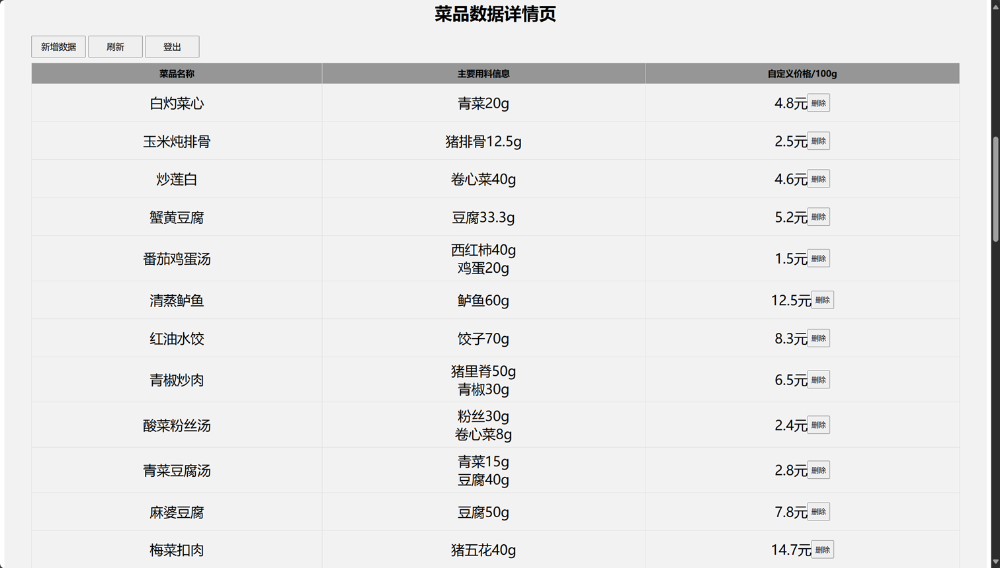

# CaloScan

**CaloScan: All-in-One Nutrition Analysis & POS System**  
智能饮食分析 + 收银一体化系统

--- 

## Table of Contents
1. [Project Overview](#project-overview)
2. [Features](#features)
3. [Demo](#demo)
4. [Architecture](#architecture)
5. [Installation and Usage](#installation)
6. [Technologies](#technologies)
7. [Contributing](#contributing)
8. [License](#license)

---

## Project Overview
CaloScan addresses the growing demand for efficient and healthy dining in community canteens across the country. With the rise of various community dining facilities and the increasing attention of modern people to dietary health, traditional canteen operations face several challenges:

- **Low Efficiency During Peak Hours**: Manual checkout is slow and inefficient, especially during mealtimes.

- **High Management Pressure**: Backend management of multiple canteens is labor-intensive, with significant differences in performance between locations.

- **Difficult Record Keeping**: Manual dietary records are cumbersome and hard to maintain, particularly for elderly users who are more concerned about their health.

- **Challenging Analysis**: Most users lack the knowledge to interpret nutritional information.

- **Limited Personalized Guidance**: There is a shortage of individualized dietary recommendations.

CaloScan aims to overcome these issues by integrating automatic dish recognition and weighing, synchronized dietary records, personalized analysis, and intelligent recommendations, while providing an admin backend for canteen managers to efficiently manage dish information.

---

## Features
- **Automatic Dish Recognition + Weighing**: Fully automated checkout system.  
- **Synchronized Dietary Records**: Dish information is uploaded automatically during payment.  
- **Personalized Analysis & Recommendations**: Intelligent dietary suggestions via WeChat Mini Program.  
- **Admin Backend**: Canteen managers can manage dish information efficiently.  

---

## Demo
<div align="center">

| Wechat Mini Program Demo 1 | Wechat Mini Program Demo 2 | Wechat Mini Program Demo 3 |
|--------|--------|--------|
|  |  |  |

| Wechat Mini Program Demo 4 | Wechat Mini Program Demo 5 | Wechat Mini Program Demo 6 |
|--------|--------|--------|
|  |  |  |

</div>

<div align="center">

| Qt Demo 1 | Qt Demo 2 |
|--------|--------|
|  |  |

</div>

<div align="center">

| Web Demo 1 | Web Demo 2 |
|--------|--------|
|  |  |

</div>


---
## Architecture
```
project/
├── Model/
│   ├── split_data.py              # 将food2K数据集划分训练/验证集
│   ├── delete_ErrorImage.py       # 清除错误图像
│   ├── data_mean_std.py           # 计算数据集RGB均值与方差
│   ├── model.py                   # ResNet模型文件（18/34/50/101, ResNeXt-50/101）
│   ├── train.py                   # 模型训练（默认ResNet50，200 epoch）
│   ├── class_indices.json         # 类别 ↔ 索引映射
│   ├── banch_predict.py           # 模型验证
│   └── permission_check.py        # 文件夹读写权限检查
│
├── Get_dish_id/
│   └── get_str.py                 # 生成类别编号与菜名映射文件
│
├── pytorch_to_caffe_master/
│   ├── pytorch_to_caffee.py       # 核心转换工具
│   └── resnet_pytorch_2_caffee.py # Pytorch模型转Caffe模型
│
├── Wechat_program/                     # 需配合华为云 & 微信开发者工具
│
├── Cloud/
│   ├── 华为云RDS (MySQL)          # 用户信息存储
│   ├── 华为云OBS                  # 菜品信息存储
│   ├── 华为云ECS                  # 部署推荐算法
│   └── 华为云IoTDA                # IoT设备交互
│
├── Web/ (缺失)              # 管理员操作界面
└── Qt/ (缺失)               # 支持人脸支付与价格展示
```

---


---

## Installation

### 1. 环境准备
- Python 3.7+
- [PyTorch](https://pytorch.org/get-started/locally/)  
- 其他常见依赖库

### 2. 模型训练
- 克隆仓库：
```bash
git clone https://github.com/williamool/CaloScan.git
```

- 配置数据集：<br>
数据集地址：[LargeFineFoodAI](https://platform.sankuai.com/foodai2021.html#index)<br>
修改split_data.py, delete_ErrorImage.py, data_mean_std.py中的数据集路径<br>
运行脚本准备数据：
```bash
python split_data.py
python delete_ErrorImage.py
python data_mean_std.py
```

- 训练模型：
运行以下命令开始训练（默认使用**Resnet 50**，训练**200 epoch**）
```bash
python train.py
```

- 模型验证：
运行以下命令以验证模型
```bash
python banch_predict.py
```

### 3. 模型转换（Pytorch → Caffe → 海思NNIE）
- 使用工具目录`pytorch_to_caffe_master/`：
- `resnet_pytorch_2_caffee.py`  
  - 修改 **模型路径** 与 **保存路径**  
  - 运行后生成 `.prototxt`（网络结构）与 `.caffemodel`（权重）  
- `pytorch_to_caffee.py`  
  - 核心转换文件，无需修改  

- 检查网络结构
使用 [Netscope](https://ethereon.github.io/netscope/#/editor) 可视化工具检查生成的 `.prototxt` 文件是否正确

- 转换为NNIE引擎可执行的.wk文件：<br>
在 **海思 RuyiStudio** 中将 Caffe 模型转换为 `.wk` 文件，用于 Hi3516 部署

### 4. 微信小程序
- 环境依赖：微信开发者工具、华为云SDK
- 导入 `Wechat_program` 代码至**微信开发者工具**
- 配置后端API地址（ECS部署服务）
- 使用华为云账号完成云服务对接

### 5. 华为云
- 依赖服务：<br>
  - **华为云RDS**（MySQL）：建表，导入用户信息<br>
  - **华为云OBS**（对象存储服务）：上传菜品信息（名称、营养成分等）<br>
  - **华为云ECS**（服务器）：部署推荐算法与后端服务<br>
  - **华为云IoTDA**：配置Hi3861设备接入
- 代码框架：
`Cloud/`

### 6. Web端
- 依赖环境：<br>
  - **Node.js/MySQL** <br>
  - **后端API**
- 功能：<br>
  - 可视化展示菜品销量信息<br>
  - 支持管理员实时修改菜品单价与营养成分信息

### 7. Qt端
- 依赖环境：
**Qt 5**
- 功能：<br>
  - 展示菜品单价及总价<br>
  - 支持用户人脸注册，人脸支付

---
